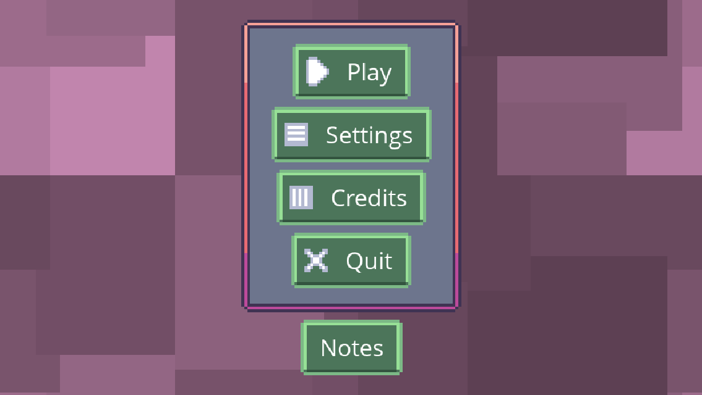
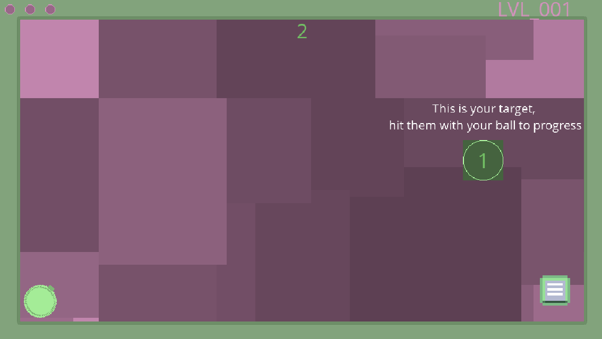
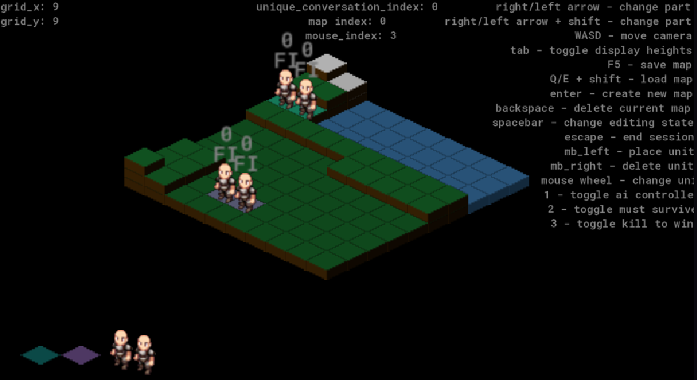
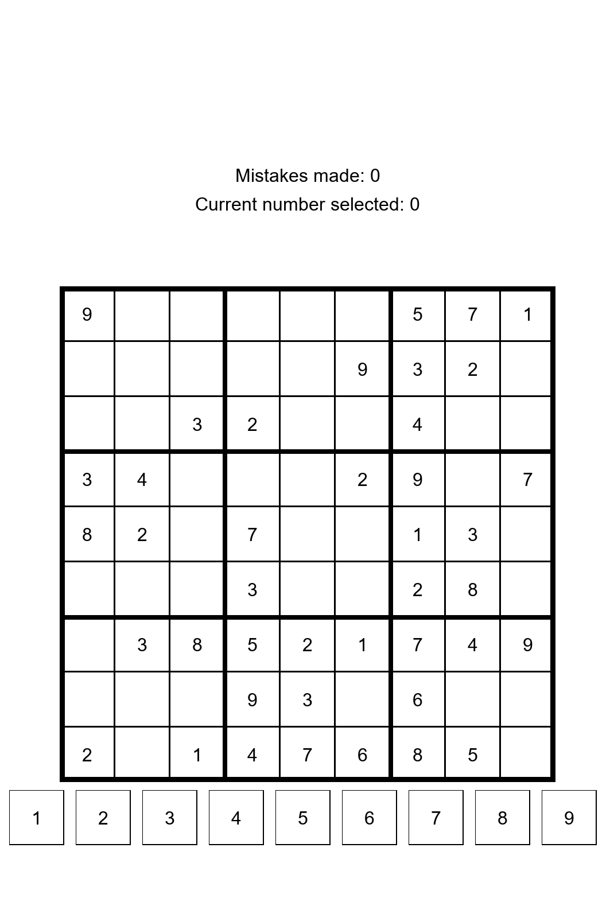

# GamemakerPortfolio
These are my various projects made using the GameMaker 2D engine.

## Physics Puzzle Game

Here is a [physics puzzle game](https://gx.games/games/urfo75/physicspuzzlegame/tracks/3931c7af-8b0f-4472-a29b-eda0d0a156f4/) I created to explore GameMaker's UI panels and physics system, designed for mobile platforms. Click the link to play it in the browser on GX.games, and note that the game is intended to be played on mobile. The project source is available in the `PhysicsPuzzleGame/` folder in this repository.

### My Learning Outcomes
- UI Panels
- Level Design
- GameMaker Physics
- Mobile game development
- Rapid prototyping
- Blind playtesting workflows

### Future Developments
- More levels
- Leaderboard
- Scoring/Grading system

## Isometric Tactics Game Level Editor

This repository also includes an [Isometric Tactics game level editor](https://gx.games/games/sxf6us/isometricgame/tracks/b9575e97-92f6-4e65-942b-05878ab3a5a4/) that I developed in the GameMaker engine. Click the link to try the level editor in the browser on GX.games, but keep in mind that not everything will function as intended in-browser; the level editor is currently intended to be used in the engine. The level editor source is located in the `Isometric_Level_Editor/` folder in this repository.

### My Learning Outcomes
- Grid data structures
- Integrating csv files in game design
- Reading from and writing to .ini files in gamemaker
- Making tools for game developers

### Future Developments
- Undo/Redo
- Better UI, make it look like an actual editor application
- I want to make an example game to showcase the level editor
- Battle System?

### Retrospective
Upon reflection, I might need to rethink how the grid works. If someone were to use my level editor, it would force them to develop their isometric tactics game using similar patterns as I did in making my grids. I am not sure if this is a good thing or bad.

## Sudoku Puzzle Game

This is a [Sudoku puzzle game](https://gx.games/games/gjqrpa/sudokuforios/tracks/9995dc72-24fb-47d0-ba15-815ae40a78c4/) developed in GameMaker. The project source is available in the `Sudoku/` folder in this repository. This is my latest project I have worked on and is still very early in development.

### My Learning Outcomes
- Puzzle game mechanics
- Mobile app development
- Puzzle generation

### Future Developments
- Difficulty levels
- Timer and scoring
- Hint system
- More puzzle variations

## Game Jams
Here are two games from game jams I participated in. These are both solo projects that I completed in 24 hour game jams. They are both WIPs that I hope to return to at sometime.

- **[Distracted Driving](https://gx.games/games/axj7c8/distracted-driving/tracks/b4524ddd-aa02-486d-84a3-db2c8d36c6bf/)**
  - Distracted Driving is a game where you are driving a car while trying to also play your mobile game. You must drive your car while avoiding collision with other cars and succeed in your mobile game at the same time.
  - Controls:
    - WASD to move your car
    - Move mouse to aim in the mobile game
    - Left click to shoot in the mobile game
    - Right click to drag your phone

- **[TileGame](https://gx.games/games/ug5tjj/tilegame/tracks/0f3509e1-517e-4980-bd95-5b8d7751ed83/)**
  - A game that I first had the idea for in school when we had a project where we made a board game. This was also my first ever game jam.
  - To play the game you just click on bordering tiles to place your tiles. If you place your tiles in opposite sides then it creates a connection, once the board is full the game is over and whoever controls the most amount of the board is the winner.
  - I was not able to fully implement all features of this game in the time of the game jam.
